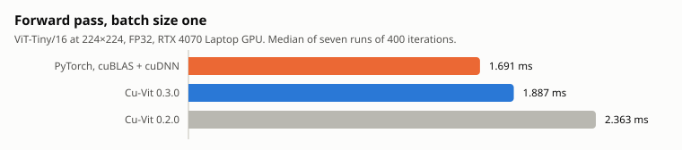
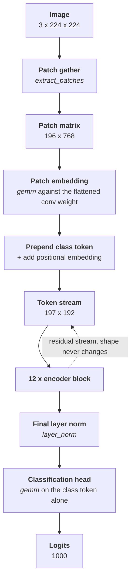
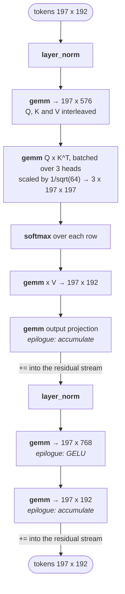
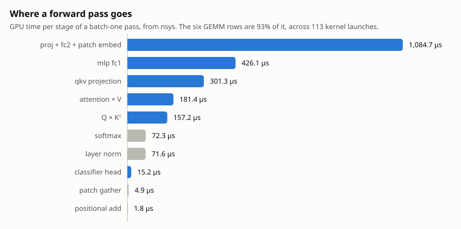
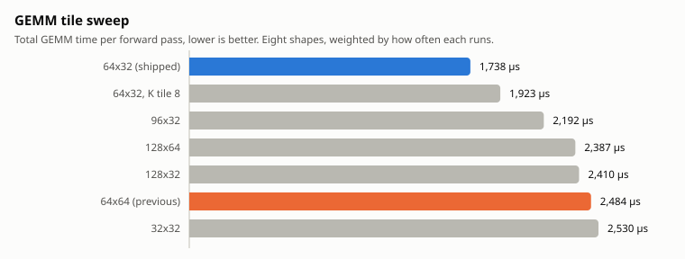
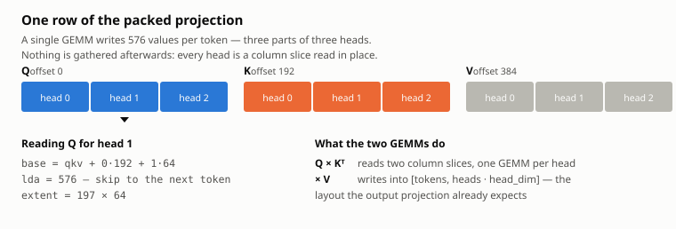

# Cu-Vit

**A Vision Transformer (ViT) inference engine implemented from scratch in CUDA C++.**

Cu-Vit is an educational, performance-oriented implementation of the Vision
Transformer architecture ([Dosovitskiy et al., 2020](https://arxiv.org/abs/2010.11929)).
The project maps transformer operations directly to CUDA kernels instead of hiding
them behind a high-level deep learning framework.

> **Status:** End-to-end inference works. ViT-Tiny/16 runs on hand-written CUDA
> kernels and reproduces PyTorch's logits to within 1.6e-5. Mixed precision,
> tensor cores, and batching are not done yet.

<picture>
  <source media="(prefers-color-scheme: dark)" srcset="docs/latency-dark.svg">
  
</picture>

## Current capabilities

- CMake-based C++17/CUDA 17 build with configurable GPU architecture.
- Context-rich CUDA runtime error reporting through `CUVIT_CUDA_CHECK`.
- Move-only `DeviceBuffer<T>` with RAII ownership, checked host/device copies,
  device-to-device copies, bounds validation, and zero fill. Each buffer records
  the device it was allocated on, frees on that device, and rejects cross-device
  and self-overlapping copies.
- Move-only `HostBuffer<T>` holding page-locked host memory for staging.
- Move-only `Stream` owning a non-blocking CUDA stream.
- Non-owning strided `TensorView<T>` with slicing, axis selection, transposition,
  and reshaping, expressing the QKV split and per-head attention layouts without
  copying.
- `DeviceArena`, a 256-byte-aligned bump allocator placing all 152 ViT-Tiny
  tensors in one allocation.
- A versioned weight file format, its loader, and a timm exporter.
- Asynchronous `_async` counterparts for every transfer, so a full
  host-to-device, kernel, device-to-host path can run on one stream.
- Active CUDA device discovery and capability reporting, cached per device.
- Hand-written kernels for tiled batched GEMM, LayerNorm, softmax, GELU, residual
  addition, and patch extraction.
- A complete ViT forward pass: patch embedding, class token, positional
  embedding, twelve encoder blocks of multi-head attention and MLP, and the
  classification head.
- Image preprocessing and a command-line classifier.
- CTest coverage for memory ownership, data transfers, bounds checks, error
  propagation, page-locked allocation, stream lifetime, asynchronous pipelines,
  and kernel correctness across boundary sizes.
- Shared test support: seeded reproducible data, CPU reference implementations,
  and tolerance-aware comparisons that report which element disagreed.
- Clean `compute-sanitizer` memcheck runs for the executable and tests.

## Why Cu-Vit?

Most ViT implementations live behind PyTorch or TensorFlow abstractions. Cu-Vit
strips those away to answer a lower-level question: *what does it take to run a
Vision Transformer efficiently on a GPU?* The project is intended for:

- Learning how transformer math maps onto CUDA kernels and GPU memory hierarchy.
- Experimenting with kernel fusion, tiling, and precision strategies.
- Comparing hand-written kernels with cuBLAS and cuDNN baselines.

Correctness comes first: every kernel is checked against a CPU or library reference
before performance optimization begins.

## Target architecture

The first inference milestone targets ViT-Tiny/16 with a 224x224 input, batch size
one, and FP32 arithmetic. Training and backpropagation are outside the initial scope.

The inference path, with the shape at each step:



One encoder block. The two residual additions and the MLP's GELU are folded into
the preceding GEMM's store rather than run as separate kernels:



Eight kernel launches per block, ninety-six for the encoder, 113 for the whole
pass.

## The forward pass, stage by stage

Every stage, the kernel that runs it, and the shape it produces. `T` is the 197
tokens -- 196 patches plus the class token -- and `E` the 192-wide embedding.

| Stage | Kernel | Reads | Writes | Launches |
| --- | --- | --- | --- | --- |
| Patch gather | `extract_patches` | `3 x 224 x 224` | `196 x 768` | 1 |
| Patch embedding | `gemm` | `196 x 768`, `192 x 768` | `196 x E` | 1 |
| Class token | `cudaMemcpyAsync` | `1 x E` | row 0 | 1 |
| Positional embedding | `add` | `T x E` | `T x E` | 1 |
| **Per block, 12 times** | | | | **8** |
| &nbsp;&nbsp;Layer norm | `layer_norm` | `T x E` | `T x E` | |
| &nbsp;&nbsp;QKV projection | `gemm` | `T x E`, `3E x E` | `T x 3E` | |
| &nbsp;&nbsp;Attention logits | `gemm` batched x3 | two slices of `T x 3E` | `3 x T x T` | |
| &nbsp;&nbsp;Softmax | `softmax` | `3T x T` | `3T x T` | |
| &nbsp;&nbsp;Attention context | `gemm` batched x3 | `3 x T x T`, a slice of `T x 3E` | `T x E` | |
| &nbsp;&nbsp;Output projection | `gemm` **+= epilogue** | `T x E`, `E x E` | `T x E` | |
| &nbsp;&nbsp;Layer norm | `layer_norm` | `T x E` | `T x E` | |
| &nbsp;&nbsp;MLP | `gemm` **GELU epilogue**, `gemm` **+=** | `T x E` | `T x E` | |
| Final layer norm | `layer_norm` | `T x E` | `T x E` | 1 |
| Classification head | `gemm` | row 0 of `T x E`, `1000 x E` | `1000` | 1 |

Two things the table makes concrete. The residual stream is one buffer that
never changes shape and is written in place by the GEMM epilogues, so a block
allocates nothing. And attention never materializes a transposed copy: both
batched GEMMs address the packed projection through a leading dimension.

<picture>
  <source media="(prefers-color-scheme: dark)" srcset="docs/breakdown-dark.svg">
  
</picture>

## Requirements

- NVIDIA GPU with CUDA Compute Capability 7.0 or newer.
- CUDA Toolkit 11.x or 12.x. The selected architecture must be supported by the
  installed toolkit.
- CMake 3.18 or newer.
- A C++17-compatible host compiler.
- Ninja or Make.
- `compute-sanitizer` for GPU memory validation.
- cuBLAS and cuDNN will be optional reference backends in later stages.

Check the local toolchain with:

```bash
nvcc --version
nvidia-smi
cmake --version
```

## Build

The default build targets Ada GPUs (`sm_89`). Override
`CMAKE_CUDA_ARCHITECTURES` for another GPU generation.

```bash
cmake -S . -B build \
  -DCMAKE_BUILD_TYPE=Release \
  -DCMAKE_CUDA_ARCHITECTURES=89

cmake --build build --parallel
```

Examples:

```bash
# Ampere
cmake -S . -B build -DCMAKE_CUDA_ARCHITECTURES=86

# Volta
cmake -S . -B build -DCMAKE_CUDA_ARCHITECTURES=70
```

Disable tests when only the library and executable are needed:

```bash
cmake -S . -B build -DCUVIT_BUILD_TESTS=OFF
```

## Run inference

Export the weights once, then classify:

```bash
python3 tools/export_vit_weights.py --model vit_tiny_patch16_224 --output vit_tiny.cvw

# From an image. Convert to binary PPM first:
#   ffmpeg -i photo.jpg -pix_fmt rgb24 photo.ppm
./build/cu-vit --weights vit_tiny.cvw --image photo.ppm --top 5

# From an already preprocessed float32 tensor, 3x224x224 planar:
./build/cu-vit --weights vit_tiny.cvw --raw input.bin --benchmark 200
```

```text
Cu-Vit
GPU: NVIDIA GeForce RTX 4070 Laptop GPU (compute 8.9)
Weights: 152 tensors, 21.81 MiB; activations 2.46 MiB

Top 5:
   646     7.2046    9.85%
   794     6.7662    6.36%
   971     6.5440    5.09%
   815     6.5097    4.92%
   701     6.2187    3.68%

Forward pass: 1.887 ms  (530.0 images/s over 400 iterations)
```

## Accuracy and speed

Against `timm`'s `vit_tiny_patch16_224` on the same input, batch size one,
FP32 throughout:

| | Cu-Vit | PyTorch (cuBLAS/cuDNN) |
| --- | --- | --- |
| Largest logit difference | 1.6e-05 | reference |
| Forward pass | 1.887 ms | 1.691 ms |
| Throughput | 530 images/s | 591 images/s |

The top-5 predictions are identical. Median of seven runs of 400 iterations each,
on an RTX 4070 Laptop GPU. The chart is at the top of this file.

Cu-Vit is 1.12x slower than the vendor libraries. Both are far from the card's
15.6 TFLOPS: at batch size one this model is 2.51 GFLOP of work spread over 113
kernel launches, so Cu-Vit reaches 1.33 TFLOPS and PyTorch 1.48. The problem is
too small to fill the GPU, which is what the remaining optimization work has to
address -- batching, or fewer and larger kernels.

## Why the tile is 64x32

The first working version used a 64x64 tile and took 2.363 ms. Profiling said
the GEMM was 91.7% of GPU time, and `ncu` said why: the most frequent shape,
`[197, 192]`, is covered by 12 blocks, which over 36 SMs measured **0.08 waves per
multiprocessor**, with the SMs at 8% throughput and DRAM at 5%. Neither compute
nor bandwidth bound -- simply not enough blocks to occupy the machine.

Halving the tile width doubles the block count at the same occupancy per block.
Measured across the eight shapes this model issues, summed with their per-pass
multiplicities:

<picture>
  <source media="(prefers-color-scheme: dark)" srcset="docs/tile-sweep-dark.svg">
  
</picture>

Picking the best tile per shape instead of one for all buys a further 6%, which
is inside the run-to-run spread, so the kernel keeps a single tile.

Wider tiles win once the matrices are large enough to fill the GPU anyway. This
choice belongs with batch-size-one inference, not with the kernel.

The residual addition and the MLP's GELU are folded into the GEMM's store, which
removes 36 launches per pass and one scratch buffer. That is worth 1%, not the
3.5% those kernels cost separately -- the epilogue absorbs most of it -- but it
is consistent across runs and it is memory the model no longer needs.

## Tests

Run the full test suite with:

```bash
ctest --test-dir build --output-on-failure
```

Run GPU memory validation with:

```bash
compute-sanitizer --tool memcheck --error-exitcode=1 ./build/device_buffer_test
compute-sanitizer --tool memcheck --error-exitcode=1 ./build/host_buffer_test
compute-sanitizer --tool memcheck --error-exitcode=1 ./build/stream_test
compute-sanitizer --tool memcheck --error-exitcode=1 ./build/vector_add_test
compute-sanitizer --tool memcheck --error-exitcode=1 ./build/cu-vit
```

## Transfers

`cudaMemcpyAsync` is only asynchronous when the host side is page-locked. A copy
issued from pageable memory is staged through a driver bounce buffer and blocks
the caller, so pair the `_async` transfers with `HostBuffer<T>`:

```cpp
cuvit::Stream stream;
cuvit::HostBuffer<float> host(count);
cuvit::DeviceBuffer<float> device(count);

device.copy_from_host_async(host.data(), host.size(), stream.get());
cuvit::launch_vector_add(a, b, out, count, stream.get());
device.copy_to_host_async(host.data(), host.size(), stream.get());
stream.synchronize();
```

The host buffer and the device buffer must both outlive the stream
synchronization.

## Testing approach

Every kernel is checked against a CPU reference in `tests/reference/`, written in
the plainest form the operation allows. Inputs come from a seeded generator, so a
failure can always be reproduced.

Choosing a tolerance matters more than it looks. An elementwise kernel rounds
identically to its reference and is held to bitwise equality. A reduction does
not: the GPU accumulates in a different order than the CPU, so results differ by
rounding alone. That error must be judged against the magnitude of the terms
being summed, not the magnitude of the result -- under cancellation a sum can be
far smaller than the values that produced it, making a negligible error look
enormous. Measured over dot products of normally distributed vectors, comparing a
32-wide blocked accumulation against a sequential one:

| Reduction length | Error vs. result | Error vs. summed terms |
| ---------------- | ---------------- | ---------------------- |
| 64               | 3.8e-05          | 2.0e-07                |
| 192              | 6.3e-05          | 2.3e-07                |
| 768              | 6.3e-04          | 1.9e-07                |
| 3072             | 3.2e-04          | 1.9e-07                |

The result-relative error moves by an order of magnitude and follows no usable
bound; the term-relative error holds near two ULP throughout. So `compare_close`
serves elementwise work, and `compare_close_scaled` takes the accumulated
magnitudes and serves reductions.

`numerics_test` checks these helpers against each other's failure modes, because
a comparison that silently accepts everything would make every other test pass
while proving nothing.

## Weights

Weights live in a flat versioned file: a header, a table of entries, then the
payloads, each aligned to 64 bytes. Reading it needs no third-party parser, and a
file written by an older exporter is refused by version rather than misread. A
tensor is fetched by name and checked against the shape the caller expects, since
a model that quietly ran with a mis-shaped weight would produce plausible output
and cost far more time than a failed load.

Export a timm checkpoint with:

```bash
python3 tools/export_vit_weights.py --model vit_tiny_patch16_224 --output vit_tiny.cvw
```

ViT-Tiny/16 yields 152 tensors totalling 5,717,416 parameters (21.8 MiB of
payload). The exported values are bit-identical to the PyTorch state dict.

## Memory layout

`DeviceBuffer` owns memory; `TensorView` only describes it. Keeping the two apart
means slicing and reshaping never raise a question about who frees what, and a
view stays cheap enough to pass by value.

Strides are explicit rather than implied by the shape, because attention reads
one buffer through several layouts: a packed QKV projection split into three
views, and `[tokens, heads, head_dim]` read as `[heads, tokens, head_dim]`. Both
are stride changes over memory that must not be copied. A view that is no longer
densely packed reports `is_contiguous() == false`, and `reshape` refuses it
rather than silently producing a wrong layout.

`DeviceArena` suballocates from a single `DeviceBuffer` with 256-byte alignment,
matching what `cudaMalloc` itself guarantees. ViT-Tiny's 152 weight tensors then
cost one allocation instead of 152.

## Attention without copies

The three projections a block needs come from one GEMM, which leaves Q, K and V
interleaved as `[tokens, 3, heads, head_dim]`. Every later step reads slices of
that buffer in place, through a leading dimension and a batch stride, so nothing
is gathered or transposed between the projection and the output:

<picture>
  <source media="(prefers-color-scheme: dark)" srcset="docs/qkv-layout-dark.svg">
  
</picture>

- `Q @ K^T` per head reads two column slices of the packed buffer
- `attention @ V` writes straight into the `[tokens, heads * head_dim]` layout
  the output projection expects

A patch embedding is a convolution whose kernel equals its stride, so it visits
every input element exactly once. It runs as a gather into a
`[patches, channels * patch * patch]` matrix followed by a single GEMM against
the flattened convolution weight, rather than as a general convolution.

## Project structure

```text
Cu-Vit/
├── include/cuvit/
│   ├── cuda_check.hpp       # CUDA error handling
│   ├── device_buffer.hpp    # Move-only GPU allocation owner
│   ├── device_info.hpp      # Active device metadata
│   ├── host_buffer.hpp      # Move-only page-locked host memory
│   ├── device_arena.hpp     # Aligned bump allocator over one allocation
│   ├── image.hpp            # PPM loading and preprocessing
│   ├── kernels.hpp          # Kernel launchers
│   ├── stream.hpp           # Move-only CUDA stream owner
│   ├── tensor.hpp           # Non-owning strided view
│   ├── vector_add.hpp       # Smoke-kernel interface
│   ├── vit.hpp              # The model
│   └── weights.hpp          # Weight file format and loader
├── src/
│   ├── kernels/             # CUDA kernels
│   ├── model/               # The ViT forward pass
│   ├── runtime/             # Runtime, device, weight, and image utilities
│   └── main.cpp             # Command-line classifier
├── docs/                    # README figures, light and dark
├── tools/
│   ├── export_vit_weights.py  # timm checkpoint -> .cvw
│   └── render_charts.py       # regenerates docs/*.svg
├── tests/
│   ├── reference/           # Naive CPU implementations kernels are judged against
│   ├── test_utils.hpp       # Comparisons, seeded data, test entry point
│   └── *.cu                 # CTest correctness tests
├── CMakeLists.txt
├── LICENSE
└── README.md
```

## Roadmap

- [x] Project skeleton and CMake CUDA build.
- [x] Device-memory utilities and CUDA error checking.
- [x] Streams, page-locked host staging, and asynchronous transfers.
- [x] Test support: seeded data, CPU references, tolerance-aware comparison.
- [x] Tensor shape, layout, and view abstractions.
- [x] Versioned weight format and pretrained ViT weight exporter.
- [x] Tiled batched GEMM with leading dimensions and a CPU reference.
- [x] LayerNorm, GELU, and softmax kernels.
- [x] Patch embedding, CLS token, and positional encoding.
- [x] Multi-head self-attention.
- [x] MLP and transformer encoder block.
- [x] Full encoder stack and classification head.
- [x] Image preprocessing and end-to-end inference.
- [x] Profile-driven GEMM tiling and epilogue fusion.
- [ ] FP16/mixed precision and tensor cores.
- [ ] Batched inference and a cuBLAS comparison harness.

## Figures

The figures in this file are generated, not drawn:

```bash
python3 tools/render_charts.py
```

Each one is emitted twice, stepped for a light and a dark surface rather than
flipped, and embedded through `<picture>` so GitHub serves the right one. The
SVG is written directly rather than through a plotting library, which is what
keeps the marks exact and the whole set under 40 KB of diffable text. Colours
were checked for contrast against their own surface and for separation under
simulated colour-vision deficiency; every bar is also labelled with its value,
so nothing depends on telling two colours apart.

## References

- Dosovitskiy, A. et al. *An Image is Worth 16x16 Words: Transformers for Image
  Recognition at Scale.* ICLR 2021. [arXiv:2010.11929](https://arxiv.org/abs/2010.11929)
- Vaswani, A. et al. *Attention Is All You Need.* NeurIPS 2017.
  [arXiv:1706.03762](https://arxiv.org/abs/1706.03762)

## License

Cu-Vit is licensed under the Apache License 2.0. See [LICENSE](LICENSE).
